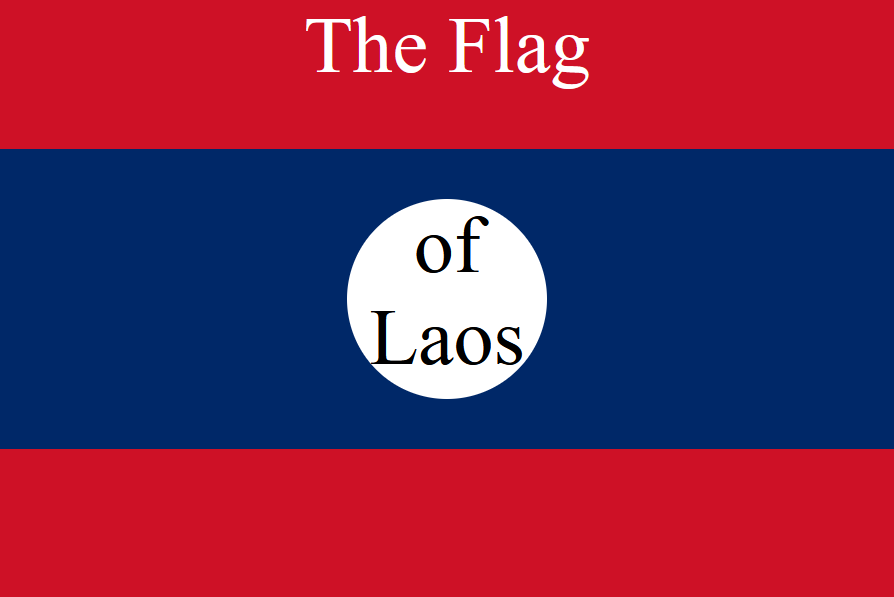

# Flag of Laos

This project demonstrates the flag of Laos using only HTML and CSS.

## How to Use

1. Clone the repository:

   ```sh
   git clone https://github.com/your-username/flag-of-laos.git
   ```

2. Open the `index.html` file in your browser to view the flag.

## Demo



## License

This project is licensed under the MIT License
